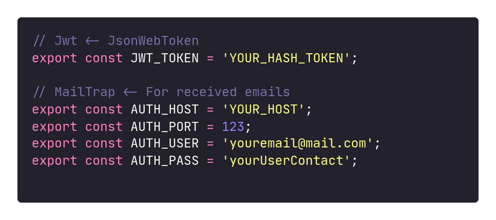

<h1 align="center">
    
</h1>

<p align="center">
  <a href="#-tecnologias">Tecnologias</a>&nbsp;&nbsp;&nbsp;|&nbsp;&nbsp;&nbsp;
  <a href="#-projeto">Projeto</a>&nbsp;&nbsp;&nbsp;|&nbsp;&nbsp;&nbsp;
  <a href="#-layout">Layout</a>&nbsp;&nbsp;&nbsp;|&nbsp;&nbsp;&nbsp;
  <a href="#-instalacao">Instalação</a>&nbsp;&nbsp;&nbsp;|&nbsp;&nbsp;&nbsp;
  <a href="#memo-licença">Licença</a>
</p>

<p align="center">
 

  
</p>

<br>

<p align="center">
  
</p>

## 🚀 Tecnologias

Esse projeto foi desenvolvido com as seguintes tecnologias:

- [Node.js](https://nodejs.org/en/)
- [React](https://reactjs.org)
- [React Native](https://facebook.github.io/react-native/)
- [Expo](https://expo.io/)
- [TypeScript](https://www.typescriptlang.org/)

## 💻 Projeto

O Happy é uma aplicação que conecta pessoas à casas de acolhimento institucional para fazer o dia de muitas crianças mais feliz 💜

## 🔖 Layout

Nos links abaixo você encontra o layout do projeto web e também do mobile. Lembrando que você precisa ter uma conta no [Figma](http://figma.com/) para acessá-lo.

- [Layout Web](https://www.figma.com/file/mDEbnoojksG4w8sOxmudh3/Happy-Web)
- [Layout Mobile](https://www.figma.com/file/X27FfVxAgy9f5IFa7ONlph/Happy-Mobile)

## 🧠 Desafio

No link a seguir você encontra o guia no Notion referente aos desafios propostos para que você possa percorrer a milha extra e incrementar ainda mais essa aplicação. Lá também você encontra um guia mostrando todo o passo a passo de como realizar o deploy tanto do backend quanto do frontend.

## :fa-cogs: Instalação

```shell
$ git clone https://github.com/Vinicius-moura-code/Next.Level_Week/tree/main/NextLevelWeek_III
```

<details>

<summary>BackEnd</summary>

> Crie um arquivo de variável na raiz do seu projeto e coloque as configurações para: JWT TOKEN e as configurações de mailtrap:

Example:


```shell
 #### Para instalar as dependencias execute: (use yarn/npm):


    $ cd backend/

    # yarn

    $ yarn   #ou yarn install

    # npm

    $ npm i  #ou npm install

    #### Para executar as migrações, execute o seguinte comando:

    # yarn

    $ yarn typeform migration:run

    # npm

    $ npm run typeorm migration:run

    #### Para excluir migrações, execute o seguinte comando:

    # yarn

    # Apaga a última migração feita
    # Para excluir ambos execute duas vezes ou exclua as tabelas diretamente do seu sgbd

    $ yarn typeform migration:revert

    # npm

    $ npm run typeorm migration:revert

    #### E finalmente ... execute...

        # yarn

        $ yarn dev

        # npm

        $ npm run dev
```

</details>

<br/>
<details>

<summary>Web and mobile</summary>

```shell
#### Apenas execute

    $ cd web/
    #or
    $ cd mobile/

#Para instalar as dependencias execute

    $ yarn

    #ou

    $ npm i #ou npm install

#### E finalmente...

#Para executar front-end web

    $ yarn start

#ou

    $ npm start
```

</details>

## :memo: Licença

Esse projeto está sob a licença MIT. Veja o arquivo [LICENSE](LICENSE.md) para mais detalhes.

---

Este projeto foi desenvolvido duranda a NLW III sob a tutoria de Diego Fernandes e Mayk Brito
Vocẽ pode participar da comunidade Rocketseat :wave: [Participe da nossa comunidade!](https://discordapp.com/invite/gCRAFhc)
