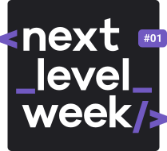

</ p>

O NLW é um evento online com muito código, desafios, networking e um único objetivo: te levar para o próximo nível.

Sempre com um conteúdo novo a cada edição, você vai descobrir na prática uma metodologia eficiente para o seu aprendizado, além de conceitos, ferramentas e hacks que vão impulsionar sua carreira.

Uma semana intensiva, desenhada para te ajudar a dar o próximo passo na sua evolução como programadora ou programador.

---

## :memo: Licença

Esse projeto está sob a licença MIT. Veja o arquivo [LICENSE](LICENSE.md) para mais detalhes.

---
Projeto desenvolvido com a tutoria de [Diego Fernandes](https://github.com/diego3g), da [Rocketseat](rocketseat.com.br).

